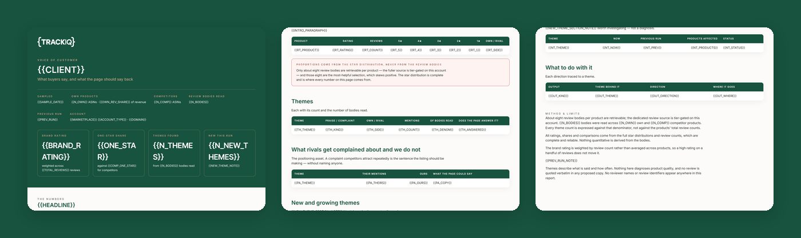

# TrackIQ: Amazon Review and Voice-of-Customer Miner

The only skill in the set that produces **creative direction** rather than another number.

**What do buyers actually say, and what should the page say back?**

Part of **Amazon Listing Management & Optimization** in the
[TrackIQ skills catalog](https://github.com/TrackIQ-HQ/amazon-seller-skills).

Built as an [Agent Skill](https://code.claude.com/docs/en/skills). Runs in
Claude Code, Claude web, Claude desktop and ChatGPT from the same folder.

---

## ⚠ This skill needs a scraper connection

Part of what this reads only exists on the public product page, so it needs an
**Oxylabs scraper** connection alongside the TrackIQ MCP. Scraper calls cost
credits per ASIN or keyword per run, and the skill states the run's cost in its
output.

There is no first-party substitute for the scraped fields — the skill says so
rather than approximating them.

---

## Powered by the TrackIQ MCP

[](https://trackiq.com/mcp)

This skill reads your live Amazon account through the
**[TrackIQ MCP](https://trackiq.com/mcp)** — 16 tools connecting your AI
assistant to Amazon data:

Sales & Traffic · Orders · Inventory · Returns · Sponsored Products · Sponsored
Brands · Sponsored Display · Amazon DSP · AMC Cloud · Keywords · Search Terms ·
Targeting · Search Query Performance · Organic Rank · Best Seller Rank · Buy Box
History · Brand Analytics · Export

Works with Claude, ChatGPT and Cursor. **[Get access →](https://trackiq.com/mcp)**

---

## What you get



Builds a voice-of-customer picture for a brand by sampling reviews across its own catalogue and its competitors, clustering what buyers praise and complain about into themes, and turning those into bullet and A+ copy directions plus negative keywords. Uses the full star distribution for anything quantitative because only about eight review bodies are retrievable per product. Use when the user asks about customer reviews, what customers are saying, voice of customer, review themes, complaints, why the rating dropped, or what to put in the copy.

### The rules that keep it honest

- **`get_reviews` returns about eight review bodies per ASIN**
- **And those eight are skewed**
- **`rating_stars_distribution` is complete and reliable**
- **This is a brand-level skill, not a per-ASIN deep dive**

The full list is in `SKILL.md`, and each one exists because getting it wrong
produces a confident, wrong answer rather than an obvious error.

## Requirements

- **The Oxylabs scraper**, for `get_reviews` and `get_product`. - The TrackIQ MCP, for `list_marketplaces`, `get_product_performance` (to pick the ASINs worth sampling) and `get_search_query_performance` (to connect complaints to search terms). - **A competitor set** — three to five ASINs. Ask, or take them from `trackiq-share-of-shelf`. - Nothing else. No filesystem, no shell. - **Without Oxylabs:** cannot see reviews at all. Ask the user to export them from Seller Central rather than guessing.

---

## Install

### Claude Code

```
/plugin marketplace add TrackIQ-HQ/amazon-seller-skills
/plugin install trackiq-amazon-review-miner@trackiq
```

### Claude web, desktop, mobile

1. Download the `.zip` from the
   [latest release](https://github.com/TrackIQ-HQ/trackiq-amazon-review-miner/releases)
2. **Settings → Capabilities → Skills** (code execution must be on)
3. **Create skill → Upload a skill**, choose the `.zip`
4. Toggle it on

### ChatGPT

Same zip. **Plugins → Skills → Create → Upload from your computer.**

---

## Setup

Answers live in `account.md`, copied from
[`assets/account.example.md`](skills/trackiq-amazon-review-miner/assets/account.example.md).
**Every TrackIQ skill reads the same file**, so an account already set up for
another TrackIQ report needs nothing added.

## Delivery

Asked once and stored in `account.md`: **in-chat** (default), **file**,
**Slack**, **n8n** or **email**. Anything leaving the chat confirms with you
first and falls back to in-chat, with a note.

---

## Customizing

| File | What it controls |
|---|---|
| `checks.md` | the pre-send checks |
| `method.md` | the method and every threshold |
| `pulls.md` | the call sequence and its traps |
| `report-template.html` | the report shell |

---

## Contributing

```bash
python scripts/validate.py    # must exit 0 before any commit
python scripts/build.py       # writes dist/ zip + registry.json
```

Read [AUTHORING.md](https://github.com/TrackIQ-HQ/amazon-seller-skills/blob/main/AUTHORING.md)
before proposing changes.

## License

MIT. See [LICENSE](LICENSE).
